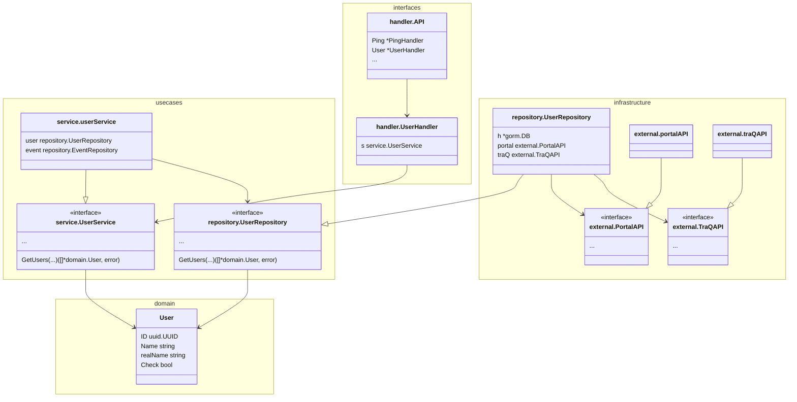

# アーキテクチャ

クリーンアーキテクチャを参考に構成

## パッケージ構成

```bash
.
├── bin # makeでコンパイルしたバイナリが入る
├── dev # 開発用の設定ファイル、スクリプト
│  └── bin # makeで使うシェルスクリプト
├── docs # ドキュメント
│  ├── dbschema # DBスキーマ(tblsで自動生成)
│  └── swagger # APIスキーマ
├── domain # domain層。他層に依存しないドメインオブジェクトを格納する
├── infrastructure # infrastructure層。他3層に依存する。
│  └── migration # DBのマイグレーション(go-gormigrate/gormigrateを使用)
├── integration_tests # 結合テスト
│  ├── handler
│  ├── repository
│  ├── testdata
│  └── testutils
├── interfaces # interface層。usecase層、domain層に依存する
│  ├── database # DB操作に関するインターフェイスを定義
│  │  └── mock_database # 単体テスト用モック(手書き)
│  ├── external # 外部サービス(traQ等)に関するインターフェイスを定義
│  │  ├── mock_external # 単体テスト用モック(mockgenで自動生成)
│  │  └── mock_external_e2e # E2Eテスト用モック(手書き)
│  ├── handler # echoハンドラーの実装、組み立て
│  └── repository # usecases/repositoryの実装
│     └── model # DBのモデル
├── usecases # usecase層。domain層に依存する
│  ├── repository # リポジトリ操作に関するインターフェイスを定義
│  │  └── mock_repository # 単体テスト用モック(mockgenで自動生成)
│  └── service # ビジネスロジックに関するインターフェイスの定義、実装
│     └── mock_service # 単体テスト用モック(mockgenで自動生成)
├── util # 汎用パッケージ
│  ├── config # config.yamlから設定を読み込む
│  │  └── testdata
│  ├── mockdata # E2Eテスト、結合テストで用いるサンプルデータを格納
│  ├── optional # null値を扱うためのパッケージ
│  └── random # テストで用いる乱数生成パッケージ
└── main.go
```

## 依存関係

ユーザー周りに限って紹介


