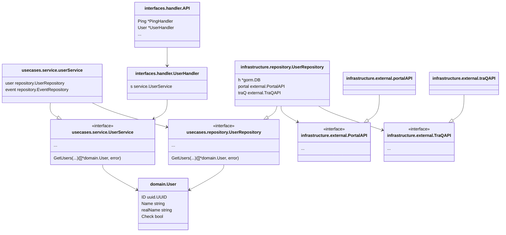

# アーキテクチャ

クリーンアーキテクチャを参考に構成

## パッケージ構成

```bash
$ tree
.
├── main.go # エントリーポイント
├── bin # makeでコンパイルしたバイナリが入る
├── dev # 開発用の設定ファイル、スクリプト
├── docs # ドキュメント
│  ├── dbschema # DBスキーマ(tblsで自動生成)
│  └── swagger # APIスキーマ
├── integration_tests # 結合テスト
│  ├── handler # handlerの結合テスト
│  ├── repository # repositoryの結合テスト
│  └── testutils # テストユーティリティ
└── internal # パッケージ内部でのみ使用するパッケージ (https://go.dev/doc/go1.4#internalpackages)
   ├── domain # ドメイン層。他層に依存しないドメインオブジェクトを格納する
   ├── handler # handler層。usecase層、domain層に依存する
   │  └── schema # APIスキーマ
   ├── infrastructure # infrastructure層。他3層に依存する。
   │  ├── external # 外部サービスAPIとの連携
   │  ├── migration # DBマイグレーション
   │  └── repository # ../repositoryの実装
   │     └── model # DBモデル
   ├── repository # リポジトリ操作に関するインターフェイスを定義
   └── util # 汎用パッケージ
      ├── config # 設定ファイルを読み込む
      ├── mockdata # テストデータ
      ├── optional # null値を扱うためのパッケージ
      └── random # 乱数生成パッケージ
```

## 依存関係

ユーザー周りに限って紹介


