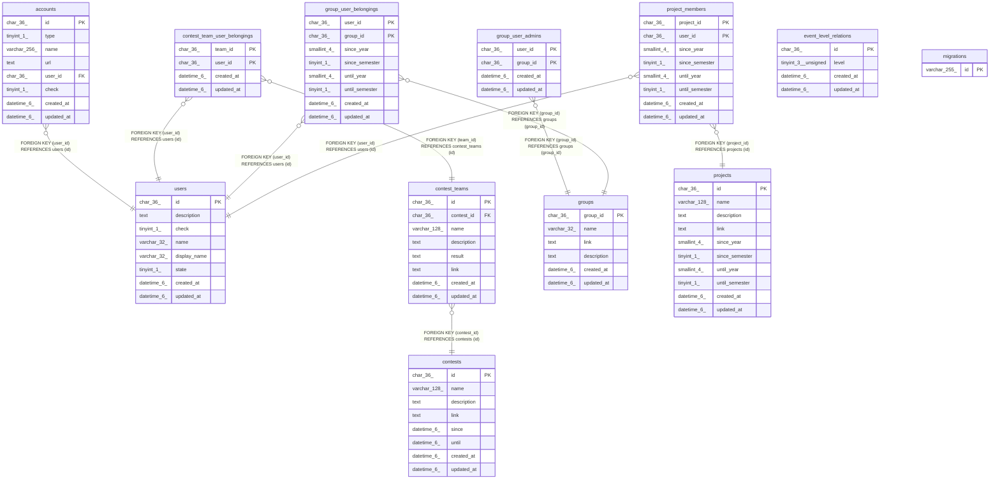

# portfolio

## Tables

| Name | Columns | Comment | Type |
| ---- | ------- | ------- | ---- |
| [accounts](accounts.md) | 8 | Twitterなどのアカウントテーブル | BASE TABLE |
| [contests](contests.md) | 8 | コンテストテーブル | BASE TABLE |
| [contest_teams](contest_teams.md) | 8 | コンテスト参加チームテーブル | BASE TABLE |
| [contest_team_user_belongings](contest_team_user_belongings.md) | 4 | コンテストチームとユーザー関係テーブル | BASE TABLE |
| [event_level_relations](event_level_relations.md) | 4 | knoQイベントと公開レベルの関係テーブル | BASE TABLE |
| [groups](groups.md) | 6 | グループテーブル | BASE TABLE |
| [group_user_admins](group_user_admins.md) | 4 | グループと管理者関係テーブル | BASE TABLE |
| [group_user_belongings](group_user_belongings.md) | 8 | グループとユーザー関係テーブル | BASE TABLE |
| [migrations](migrations.md) | 1 | gormigrate用のデータベースバージョンテーブル | BASE TABLE |
| [projects](projects.md) | 10 | プロジェクトテーブル | BASE TABLE |
| [project_members](project_members.md) | 8 | プロジェクト所属者テーブル | BASE TABLE |
| [users](users.md) | 8 | ユーザーテーブル | BASE TABLE |

## Relations

---

> Generated by [tbls](https://github.com/k1LoW/tbls)
