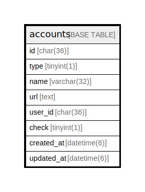

# accounts

## Description

Twitterなどのアカウントテーブル

<details>
<summary><strong>Table Definition</strong></summary>

```sql
CREATE TABLE `accounts` (
  `id` char(36) NOT NULL,
  `type` tinyint(1) NOT NULL,
  `name` varchar(32) DEFAULT NULL,
  `url` text,
  `user_id` char(36) NOT NULL,
  `check` tinyint(1) NOT NULL DEFAULT '0',
  `created_at` datetime(6) DEFAULT NULL,
  `updated_at` datetime(6) DEFAULT NULL,
  PRIMARY KEY (`id`),
  UNIQUE KEY `user_id` (`user_id`),
  CONSTRAINT `fk_accounts_user` FOREIGN KEY (`user_id`) REFERENCES `users` (`id`)
) ENGINE=InnoDB DEFAULT CHARSET=utf8
```

</details>

## Columns

| Name | Type | Default | Nullable | Children | Parents | Comment |
| ---- | ---- | ------- | -------- | -------- | ------- | ------- |
| id | char(36) |  | false |  |  | アカウントUUID |
| type | tinyint(1) |  | false |  |  | アカウントのハードコードID |
| name | varchar(32) |  | true |  |  | アカウント名 |
| url | text |  | true |  |  | アカウントのURL |
| user_id | char(36) |  | false |  | [users](users.md) | ユーザーUUID |
| check | tinyint(1) | 0 | false |  |  | 公開可能かどうか |
| created_at | datetime(6) |  | true |  |  |  |
| updated_at | datetime(6) |  | true |  |  |  |

## Constraints

| Name | Type | Definition |
| ---- | ---- | ---------- |
| fk_accounts_user | FOREIGN KEY | FOREIGN KEY (user_id) REFERENCES users (id) |
| PRIMARY | PRIMARY KEY | PRIMARY KEY (id) |
| user_id | UNIQUE | UNIQUE KEY user_id (user_id) |

## Indexes

| Name | Definition |
| ---- | ---------- |
| PRIMARY | PRIMARY KEY (id) USING BTREE |
| user_id | UNIQUE KEY user_id (user_id) USING BTREE |

## Relations



---

> Generated by [tbls](https://github.com/k1LoW/tbls)
