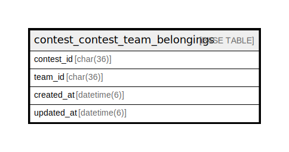

# contest_contest_team_belongings

## Description

コンテストとコンテストチーム関係テーブル

<details>
<summary><strong>Table Definition</strong></summary>

```sql
CREATE TABLE `contest_contest_team_belongings` (
  `contest_id` char(36) COLLATE utf8mb4_bin NOT NULL,
  `team_id` char(36) COLLATE utf8mb4_bin NOT NULL,
  `created_at` datetime(6) DEFAULT NULL,
  `updated_at` datetime(6) DEFAULT NULL,
  PRIMARY KEY (`contest_id`,`team_id`)
) ENGINE=InnoDB DEFAULT CHARSET=utf8mb4 COLLATE=utf8mb4_bin
```

</details>

## Columns

| Name | Type | Default | Nullable | Children | Parents | Comment |
| ---- | ---- | ------- | -------- | -------- | ------- | ------- |
| contest_id | char(36) |  | false |  |  | コンテストUUID |
| team_id | char(36) |  | false |  |  | コンテストチームUUID |
| created_at | datetime(6) |  | true |  |  | 関係テーブル作成日時 |
| updated_at | datetime(6) |  | true |  |  | 関係テーブル更新日時 |

## Constraints

| Name | Type | Definition |
| ---- | ---- | ---------- |
| PRIMARY | PRIMARY KEY | PRIMARY KEY (contest_id, team_id) |

## Indexes

| Name | Definition |
| ---- | ---------- |
| PRIMARY | PRIMARY KEY (contest_id, team_id) USING BTREE |

## Relations



---

> Generated by [tbls](https://github.com/k1LoW/tbls)
