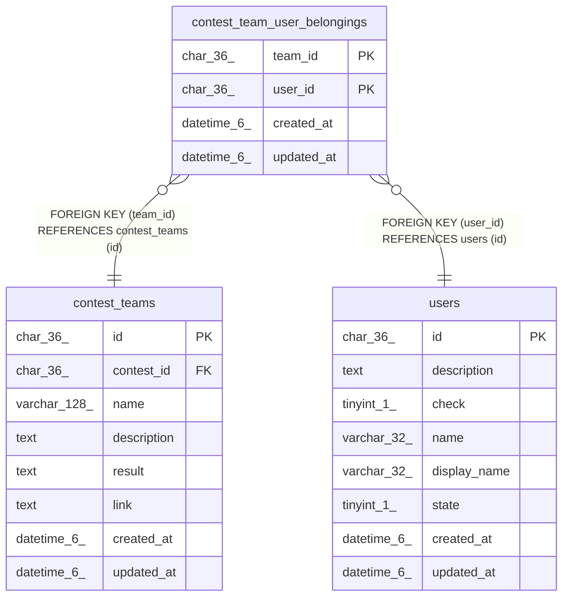

# contest_team_user_belongings

## Description

コンテストチームとユーザー関係テーブル

<details>
<summary><strong>Table Definition</strong></summary>

```sql
CREATE TABLE `contest_team_user_belongings` (
  `team_id` char(36) NOT NULL,
  `user_id` char(36) NOT NULL,
  `created_at` datetime(6) DEFAULT NULL,
  `updated_at` datetime(6) DEFAULT NULL,
  PRIMARY KEY (`team_id`,`user_id`),
  KEY `fk_contest_team_user_belongings_user` (`user_id`),
  CONSTRAINT `fk_contest_team_user_belongings_contest_team` FOREIGN KEY (`team_id`) REFERENCES `contest_teams` (`id`) ON DELETE CASCADE ON UPDATE CASCADE,
  CONSTRAINT `fk_contest_team_user_belongings_user` FOREIGN KEY (`user_id`) REFERENCES `users` (`id`) ON DELETE CASCADE ON UPDATE CASCADE
) ENGINE=InnoDB DEFAULT CHARSET=utf8mb3
```

</details>

## Columns

| Name | Type | Default | Nullable | Children | Parents | Comment |
| ---- | ---- | ------- | -------- | -------- | ------- | ------- |
| team_id | char(36) |  | false |  | [contest_teams](contest_teams.md) | コンテストチームUUID |
| user_id | char(36) |  | false |  | [users](users.md) | ユーザーUUID |
| created_at | datetime(6) | NULL | true |  |  | 関係テーブル作成日時 |
| updated_at | datetime(6) | NULL | true |  |  | 関係テーブル更新日時 |

## Constraints

| Name | Type | Definition |
| ---- | ---- | ---------- |
| fk_contest_team_user_belongings_contest_team | FOREIGN KEY | FOREIGN KEY (team_id) REFERENCES contest_teams (id) |
| fk_contest_team_user_belongings_user | FOREIGN KEY | FOREIGN KEY (user_id) REFERENCES users (id) |
| PRIMARY | PRIMARY KEY | PRIMARY KEY (team_id, user_id) |

## Indexes

| Name | Definition |
| ---- | ---------- |
| fk_contest_team_user_belongings_user | KEY fk_contest_team_user_belongings_user (user_id) USING BTREE |
| PRIMARY | PRIMARY KEY (team_id, user_id) USING BTREE |

## Relations



---

> Generated by [tbls](https://github.com/k1LoW/tbls)
