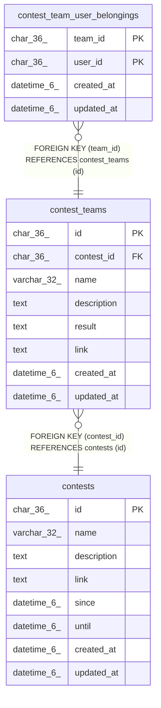

# contest_teams

## Description

コンテスト参加チームテーブル

<details>
<summary><strong>Table Definition</strong></summary>

```sql
CREATE TABLE `contest_teams` (
  `id` char(36) NOT NULL,
  `contest_id` char(36) NOT NULL,
  `name` varchar(32) DEFAULT NULL,
  `description` text DEFAULT NULL,
  `result` text DEFAULT NULL,
  `link` text DEFAULT NULL,
  `created_at` datetime(6) DEFAULT NULL,
  `updated_at` datetime(6) DEFAULT NULL,
  PRIMARY KEY (`id`),
  KEY `fk_contest_teams_contest` (`contest_id`),
  CONSTRAINT `fk_contest_teams_contest` FOREIGN KEY (`contest_id`) REFERENCES `contests` (`id`) ON DELETE CASCADE ON UPDATE CASCADE
) ENGINE=InnoDB DEFAULT CHARSET=utf8mb3
```

</details>

## Columns

| Name | Type | Default | Nullable | Children | Parents | Comment |
| ---- | ---- | ------- | -------- | -------- | ------- | ------- |
| id | char(36) |  | false | [contest_team_user_belongings](contest_team_user_belongings.md) |  | コンテストチームUUID |
| contest_id | char(36) |  | false |  | [contests](contests.md) | コンテストUUID |
| name | varchar(32) | NULL | true |  |  | チーム名 |
| description | text | NULL | true |  |  | チーム情報 |
| result | text | NULL | true |  |  | 順位などの結果 |
| link | text | NULL | true |  |  | コンテストチームの詳細が載っているページへのリンク |
| created_at | datetime(6) | NULL | true |  |  | コンテストチーム作成日時 |
| updated_at | datetime(6) | NULL | true |  |  | コンテストチーム更新日時 |

## Constraints

| Name | Type | Definition |
| ---- | ---- | ---------- |
| fk_contest_teams_contest | FOREIGN KEY | FOREIGN KEY (contest_id) REFERENCES contests (id) |
| PRIMARY | PRIMARY KEY | PRIMARY KEY (id) |

## Indexes

| Name | Definition |
| ---- | ---------- |
| fk_contest_teams_contest | KEY fk_contest_teams_contest (contest_id) USING BTREE |
| PRIMARY | PRIMARY KEY (id) USING BTREE |

## Relations



---

> Generated by [tbls](https://github.com/k1LoW/tbls)
