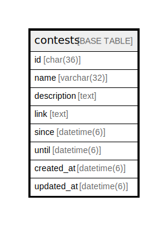

# contests

## Description

コンテストテーブル

<details>
<summary><strong>Table Definition</strong></summary>

```sql
CREATE TABLE `contests` (
  `id` char(36) NOT NULL,
  `name` varchar(32) DEFAULT NULL,
  `description` text,
  `link` text,
  `since` datetime(6) DEFAULT NULL,
  `until` datetime(6) DEFAULT NULL,
  `created_at` datetime(6) DEFAULT NULL,
  `updated_at` datetime(6) DEFAULT NULL,
  PRIMARY KEY (`id`)
) ENGINE=InnoDB DEFAULT CHARSET=utf8
```

</details>

## Columns

| Name | Type | Default | Nullable | Children | Parents | Comment |
| ---- | ---- | ------- | -------- | -------- | ------- | ------- |
| id | char(36) |  | false | [contest_teams](contest_teams.md) |  | コンテストUUID |
| name | varchar(32) |  | true |  |  | コンテスト名 |
| description | text |  | true |  |  | コンテスト説明 |
| link | text |  | true |  |  | コンテスト情報のリンク |
| since | datetime(6) |  | true |  |  | 期間始まり |
| until | datetime(6) |  | true |  |  | 期間終わり |
| created_at | datetime(6) |  | true |  |  | コンテスト作成日時 |
| updated_at | datetime(6) |  | true |  |  | コンテスト更新日時 |

## Constraints

| Name | Type | Definition |
| ---- | ---- | ---------- |
| PRIMARY | PRIMARY KEY | PRIMARY KEY (id) |

## Indexes

| Name | Definition |
| ---- | ---------- |
| PRIMARY | PRIMARY KEY (id) USING BTREE |

## Relations



---

> Generated by [tbls](https://github.com/k1LoW/tbls)
