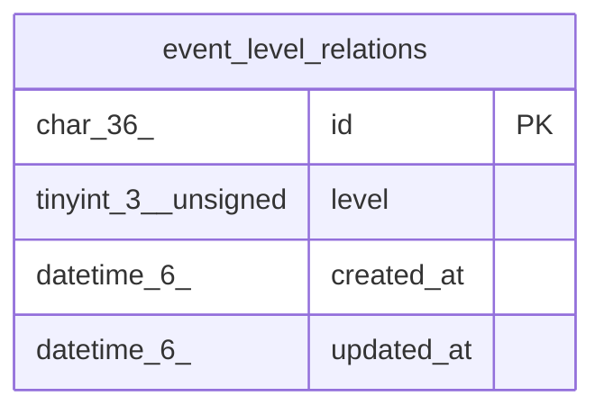

# event_level_relations

## Description

knoQイベントと公開レベルの関係テーブル

<details>
<summary><strong>Table Definition</strong></summary>

```sql
CREATE TABLE `event_level_relations` (
  `id` char(36) NOT NULL,
  `level` tinyint(3) unsigned NOT NULL DEFAULT 0,
  `created_at` datetime(6) DEFAULT NULL,
  `updated_at` datetime(6) DEFAULT NULL,
  PRIMARY KEY (`id`)
) ENGINE=InnoDB DEFAULT CHARSET=utf8mb3
```

</details>

## Columns

| Name | Type | Default | Nullable | Children | Parents | Comment |
| ---- | ---- | ------- | -------- | -------- | ------- | ------- |
| id | char(36) |  | false |  |  | knoQイベントUUID |
| level | tinyint(3) unsigned | 0 | false |  |  | 公開レベル。0なら匿名、1ならそのまま公開、2なら外部に非公開 |
| created_at | datetime(6) | NULL | true |  |  | 関係テーブル作成日時 |
| updated_at | datetime(6) | NULL | true |  |  | 関係テーブル更新日時 |

## Constraints

| Name | Type | Definition |
| ---- | ---- | ---------- |
| PRIMARY | PRIMARY KEY | PRIMARY KEY (id) |

## Indexes

| Name | Definition |
| ---- | ---------- |
| PRIMARY | PRIMARY KEY (id) USING BTREE |

## Relations



---

> Generated by [tbls](https://github.com/k1LoW/tbls)
