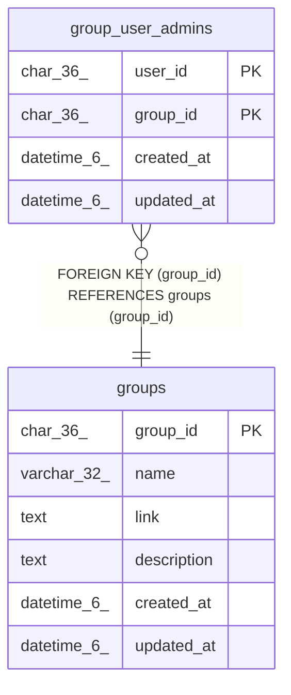

# group_user_admins

## Description

グループと管理者関係テーブル

<details>
<summary><strong>Table Definition</strong></summary>

```sql
CREATE TABLE `group_user_admins` (
  `user_id` char(36) NOT NULL,
  `group_id` char(36) NOT NULL,
  `created_at` datetime(6) DEFAULT NULL,
  `updated_at` datetime(6) DEFAULT NULL,
  PRIMARY KEY (`user_id`,`group_id`),
  KEY `fk_group_user_admins_group` (`group_id`),
  CONSTRAINT `fk_group_user_admins_group` FOREIGN KEY (`group_id`) REFERENCES `groups` (`group_id`) ON DELETE CASCADE ON UPDATE CASCADE
) ENGINE=InnoDB DEFAULT CHARSET=utf8mb3
```

</details>

## Columns

| Name | Type | Default | Nullable | Children | Parents | Comment |
| ---- | ---- | ------- | -------- | -------- | ------- | ------- |
| user_id | char(36) |  | false |  |  | ユーザーUUID |
| group_id | char(36) |  | false |  | [groups](groups.md) | グループUUID |
| created_at | datetime(6) | NULL | true |  |  | 関係テーブル作成日時 |
| updated_at | datetime(6) | NULL | true |  |  | 関係テーブル更新日時 |

## Constraints

| Name | Type | Definition |
| ---- | ---- | ---------- |
| fk_group_user_admins_group | FOREIGN KEY | FOREIGN KEY (group_id) REFERENCES groups (group_id) |
| PRIMARY | PRIMARY KEY | PRIMARY KEY (user_id, group_id) |

## Indexes

| Name | Definition |
| ---- | ---------- |
| fk_group_user_admins_group | KEY fk_group_user_admins_group (group_id) USING BTREE |
| PRIMARY | PRIMARY KEY (user_id, group_id) USING BTREE |

## Relations



---

> Generated by [tbls](https://github.com/k1LoW/tbls)
