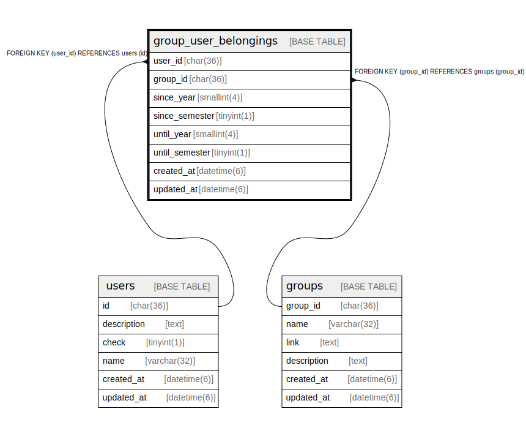

# group_user_belongings

## Description

グループとユーザー関係テーブル

<details>
<summary><strong>Table Definition</strong></summary>

```sql
CREATE TABLE `group_user_belongings` (
  `user_id` char(36) NOT NULL,
  `group_id` char(36) NOT NULL,
  `since_year` tinyint(1) NOT NULL,
  `since_semester` tinyint(1) NOT NULL,
  `until_year` tinyint(1) NOT NULL,
  `until_semester` tinyint(1) NOT NULL,
  PRIMARY KEY (`user_id`,`group_id`),
  KEY `fk_group_user_belongings_group` (`group_id`),
  CONSTRAINT `fk_group_user_belongings_group` FOREIGN KEY (`group_id`) REFERENCES `groups` (`group_id`),
  CONSTRAINT `fk_group_user_belongings_user` FOREIGN KEY (`user_id`) REFERENCES `users` (`id`)
) ENGINE=InnoDB DEFAULT CHARSET=utf8mb3
```

</details>

## Columns

| Name | Type | Default | Nullable | Children | Parents | Comment |
| ---- | ---- | ------- | -------- | -------- | ------- | ------- |
| user_id | char(36) |  | false |  | [users](users.md) | ユーザーUUID |
| group_id | char(36) |  | false |  | [groups](groups.md) | グループUUID |
| since_year | tinyint(1) |  | false |  |  | ユーザー所属開始年 |
| since_semester | tinyint(1) |  | false |  |  | ユーザー所属開始学期 |
| until_year | tinyint(1) |  | false |  |  | ユーザー所属終了年 |
| until_semester | tinyint(1) |  | false |  |  | ユーザー所属終了学期 |

## Constraints

| Name | Type | Definition |
| ---- | ---- | ---------- |
| fk_group_user_belongings_group | FOREIGN KEY | FOREIGN KEY (group_id) REFERENCES groups (group_id) |
| fk_group_user_belongings_user | FOREIGN KEY | FOREIGN KEY (user_id) REFERENCES users (id) |
| PRIMARY | PRIMARY KEY | PRIMARY KEY (user_id, group_id) |

## Indexes

| Name | Definition |
| ---- | ---------- |
| fk_group_user_belongings_group | KEY fk_group_user_belongings_group (group_id) USING BTREE |
| PRIMARY | PRIMARY KEY (user_id, group_id) USING BTREE |

## Relations



---

> Generated by [tbls](https://github.com/k1LoW/tbls)
