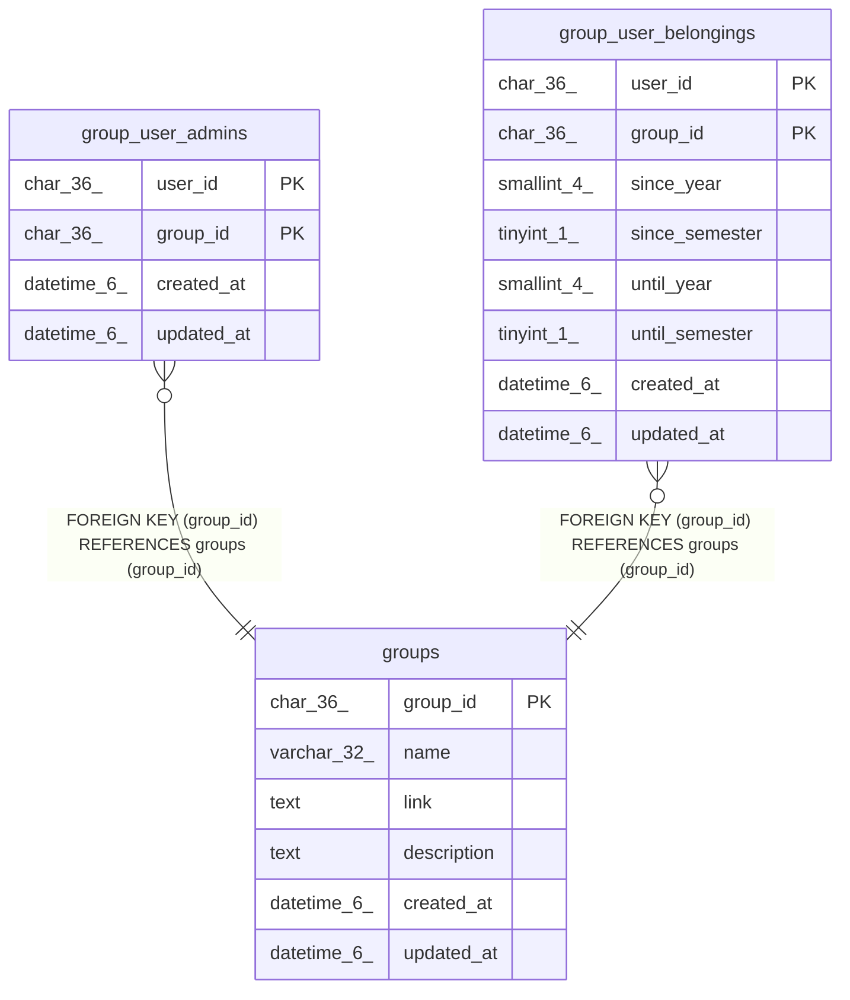

# groups

## Description

グループテーブル

<details>
<summary><strong>Table Definition</strong></summary>

```sql
CREATE TABLE `groups` (
  `group_id` char(36) NOT NULL,
  `name` varchar(32) DEFAULT NULL,
  `link` text DEFAULT NULL,
  `description` text DEFAULT NULL,
  `created_at` datetime(6) DEFAULT NULL,
  `updated_at` datetime(6) DEFAULT NULL,
  PRIMARY KEY (`group_id`)
) ENGINE=InnoDB DEFAULT CHARSET=utf8mb3
```

</details>

## Columns

| Name | Type | Default | Nullable | Children | Parents | Comment |
| ---- | ---- | ------- | -------- | -------- | ------- | ------- |
| group_id | char(36) |  | false | [group_user_admins](group_user_admins.md) [group_user_belongings](group_user_belongings.md) |  | グループUUID |
| name | varchar(32) | NULL | true |  |  | グループ名 |
| link | text | NULL | true |  |  | グループのリンク |
| description | text | NULL | true |  |  | グループの説明文 |
| created_at | datetime(6) | NULL | true |  |  | グループ作成日時 |
| updated_at | datetime(6) | NULL | true |  |  | グループ更新日時 |

## Constraints

| Name | Type | Definition |
| ---- | ---- | ---------- |
| PRIMARY | PRIMARY KEY | PRIMARY KEY (group_id) |

## Indexes

| Name | Definition |
| ---- | ---------- |
| PRIMARY | PRIMARY KEY (group_id) USING BTREE |

## Relations



---

> Generated by [tbls](https://github.com/k1LoW/tbls)
