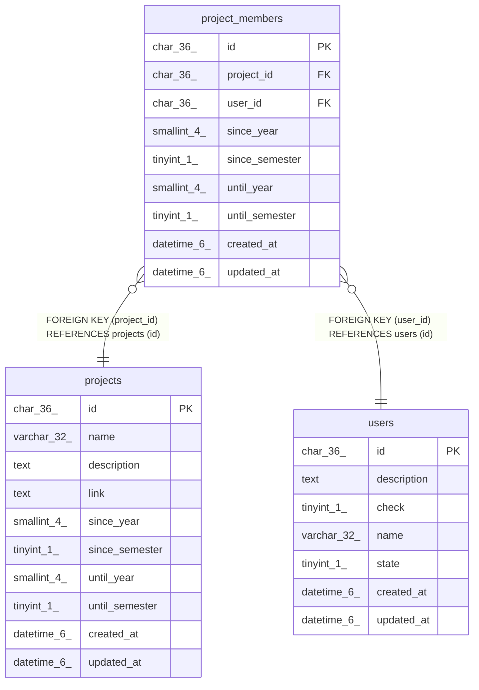

# project_members

## Description

プロジェクト所属者テーブル

<details>
<summary><strong>Table Definition</strong></summary>

```sql
CREATE TABLE `project_members` (
  `id` char(36) NOT NULL,
  `project_id` char(36) NOT NULL,
  `user_id` char(36) NOT NULL,
  `since_year` smallint(4) NOT NULL,
  `since_semester` tinyint(1) NOT NULL,
  `until_year` smallint(4) NOT NULL,
  `until_semester` tinyint(1) NOT NULL,
  `created_at` datetime(6) DEFAULT NULL,
  `updated_at` datetime(6) DEFAULT NULL,
  PRIMARY KEY (`id`),
  KEY `fk_project_members_project` (`project_id`),
  KEY `fk_project_members_user` (`user_id`),
  CONSTRAINT `fk_project_members_project` FOREIGN KEY (`project_id`) REFERENCES `projects` (`id`) ON DELETE CASCADE ON UPDATE CASCADE,
  CONSTRAINT `fk_project_members_user` FOREIGN KEY (`user_id`) REFERENCES `users` (`id`) ON DELETE CASCADE ON UPDATE CASCADE
) ENGINE=InnoDB DEFAULT CHARSET=utf8mb3
```

</details>

## Columns

| Name | Type | Default | Nullable | Children | Parents | Comment |
| ---- | ---- | ------- | -------- | -------- | ------- | ------- |
| id | char(36) |  | false |  |  |  |
| project_id | char(36) |  | false |  | [projects](projects.md) | プロジェクトUUID |
| user_id | char(36) |  | false |  | [users](users.md) | ユーザーUUID |
| since_year | smallint(4) |  | false |  |  | プロジェクト所属開始年 |
| since_semester | tinyint(1) |  | false |  |  | プロジェクト所属開始学期(0:前期 1:後期) |
| until_year | smallint(4) |  | false |  |  | プロジェクト所属終了年 |
| until_semester | tinyint(1) |  | false |  |  | プロジェクト所属終了学期(0:前期 1:後期) |
| created_at | datetime(6) | NULL | true |  |  |  |
| updated_at | datetime(6) | NULL | true |  |  |  |

## Constraints

| Name | Type | Definition |
| ---- | ---- | ---------- |
| fk_project_members_project | FOREIGN KEY | FOREIGN KEY (project_id) REFERENCES projects (id) |
| fk_project_members_user | FOREIGN KEY | FOREIGN KEY (user_id) REFERENCES users (id) |
| PRIMARY | PRIMARY KEY | PRIMARY KEY (id) |

## Indexes

| Name | Definition |
| ---- | ---------- |
| fk_project_members_project | KEY fk_project_members_project (project_id) USING BTREE |
| fk_project_members_user | KEY fk_project_members_user (user_id) USING BTREE |
| PRIMARY | PRIMARY KEY (id) USING BTREE |

## Relations



---

> Generated by [tbls](https://github.com/k1LoW/tbls)
