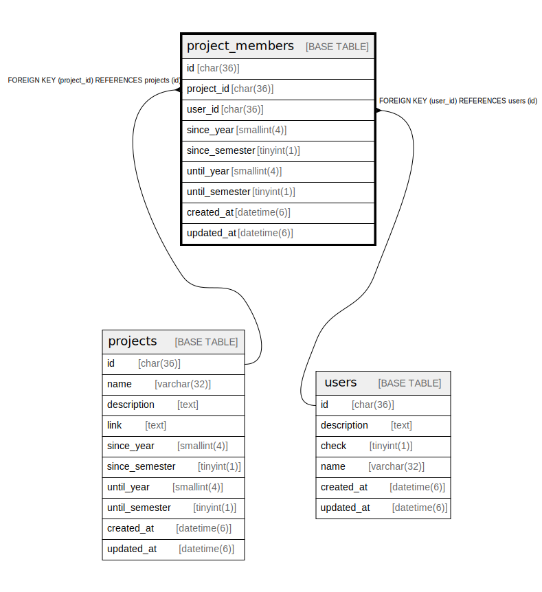

# project_members

## Description

プロジェクト所属者テーブル

<details>
<summary><strong>Table Definition</strong></summary>

```sql
CREATE TABLE `project_members` (
  `project_id` char(36) COLLATE utf8mb4_bin NOT NULL,
  `user_id` char(36) COLLATE utf8mb4_bin NOT NULL,
  `since` datetime(6) DEFAULT NULL,
  `until` datetime(6) DEFAULT NULL
) ENGINE=InnoDB DEFAULT CHARSET=utf8mb4 COLLATE=utf8mb4_bin
```

</details>

## Columns

| Name | Type | Default | Nullable | Children | Parents | Comment |
| ---- | ---- | ------- | -------- | -------- | ------- | ------- |
| project_id | char(36) |  | false |  |  | プロジェクトUUID |
| user_id | char(36) |  | false |  |  | ユーザーUUID |
| since | datetime(6) |  | true |  |  | プロジェクト所属開始時期 |
| until | datetime(6) |  | true |  |  | プロジェクト所属終了時期 |

## Relations



---

> Generated by [tbls](https://github.com/k1LoW/tbls)
