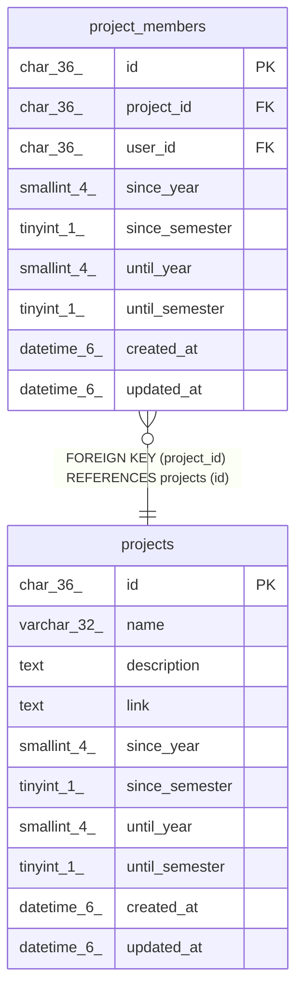

# projects

## Description

プロジェクトテーブル

<details>
<summary><strong>Table Definition</strong></summary>

```sql
CREATE TABLE `projects` (
  `id` char(36) NOT NULL,
  `name` varchar(32) DEFAULT NULL,
  `description` text DEFAULT NULL,
  `link` text DEFAULT NULL,
  `since_year` smallint(4) NOT NULL,
  `since_semester` tinyint(1) NOT NULL,
  `until_year` smallint(4) NOT NULL,
  `until_semester` tinyint(1) NOT NULL,
  `created_at` datetime(6) DEFAULT NULL,
  `updated_at` datetime(6) DEFAULT NULL,
  PRIMARY KEY (`id`)
) ENGINE=InnoDB DEFAULT CHARSET=utf8mb3
```

</details>

## Columns

| Name | Type | Default | Nullable | Children | Parents | Comment |
| ---- | ---- | ------- | -------- | -------- | ------- | ------- |
| id | char(36) |  | false | [project_members](project_members.md) |  | プロジェクトUUID |
| name | varchar(32) | NULL | true |  |  | プロジェクト名 |
| description | text | NULL | true |  |  | プロジェクト説明 |
| link | text | NULL | true |  |  | プロジェクト情報のリンク |
| since_year | smallint(4) |  | false |  |  | プロジェクト開始年 |
| since_semester | tinyint(1) |  | false |  |  | プロジェクト開始学期(0:前期 1:後期) |
| until_year | smallint(4) |  | false |  |  | プロジェクト終了年 |
| until_semester | tinyint(1) |  | false |  |  | プロジェクト終了学期(0:前期 1:後期) |
| created_at | datetime(6) | NULL | true |  |  | プロジェクト作成日時 |
| updated_at | datetime(6) | NULL | true |  |  | プロジェクト更新日時 |

## Constraints

| Name | Type | Definition |
| ---- | ---- | ---------- |
| PRIMARY | PRIMARY KEY | PRIMARY KEY (id) |

## Indexes

| Name | Definition |
| ---- | ---------- |
| PRIMARY | PRIMARY KEY (id) USING BTREE |

## Relations



---

> Generated by [tbls](https://github.com/k1LoW/tbls)
