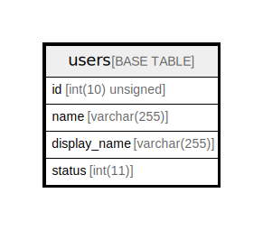

# users

## Description

ユーザーテーブル

<details>
<summary><strong>Table Definition</strong></summary>

```sql
CREATE TABLE `users` (
  `id` char(36) COLLATE utf8mb4_bin NOT NULL,
  `description` text COLLATE utf8mb4_bin NOT NULL,
  `check` tinyint(1) NOT NULL DEFAULT '0',
  `name` varchar(32) COLLATE utf8mb4_bin NOT NULL,
  `created_at` datetime(6) DEFAULT NULL,
  `updated_at` datetime(6) DEFAULT NULL,
  PRIMARY KEY (`id`),
  UNIQUE KEY `name` (`name`)
) ENGINE=InnoDB DEFAULT CHARSET=utf8mb4 COLLATE=utf8mb4_bin
```

</details>

## Columns

| Name | Type | Default | Nullable | Children | Parents | Comment |
| ---- | ---- | ------- | -------- | -------- | ------- | ------- |
| id | char(36) |  | false |  |  | ユーザーUUID |
| description | text |  | false |  |  | 自己紹介文 |
| check | tinyint(1) | 0 | false |  |  | 氏名を公開するかどうかの可否 |
| name | varchar(32) |  | false |  |  | ユーザー名 |
| created_at | datetime(6) |  | true |  |  |  |
| updated_at | datetime(6) |  | true |  |  |  |

## Constraints

| Name | Type | Definition |
| ---- | ---- | ---------- |
| name | UNIQUE | UNIQUE KEY name (name) |
| PRIMARY | PRIMARY KEY | PRIMARY KEY (id) |

## Indexes

| Name | Definition |
| ---- | ---------- |
| PRIMARY | PRIMARY KEY (id) USING BTREE |
| name | UNIQUE KEY name (name) USING BTREE |

## Relations



---

> Generated by [tbls](https://github.com/k1LoW/tbls)
