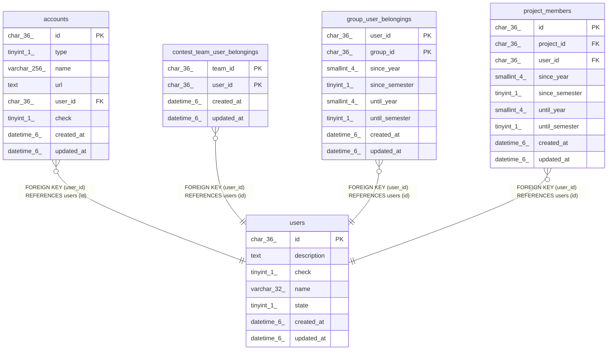

# users

## Description

ユーザーテーブル

<details>
<summary><strong>Table Definition</strong></summary>

```sql
CREATE TABLE `users` (
  `id` char(36) NOT NULL,
  `description` text NOT NULL,
  `check` tinyint(1) NOT NULL DEFAULT 0,
  `name` varchar(32) NOT NULL,
  `state` tinyint(1) NOT NULL,
  `created_at` datetime(6) DEFAULT NULL,
  `updated_at` datetime(6) DEFAULT NULL,
  PRIMARY KEY (`id`),
  UNIQUE KEY `uni_users_name` (`name`)
) ENGINE=InnoDB DEFAULT CHARSET=utf8mb3
```

</details>

## Columns

| Name | Type | Default | Nullable | Children | Parents | Comment |
| ---- | ---- | ------- | -------- | -------- | ------- | ------- |
| id | char(36) |  | false | [accounts](accounts.md) [contest_team_user_belongings](contest_team_user_belongings.md) [group_user_belongings](group_user_belongings.md) [project_members](project_members.md) |  | ユーザーUUID |
| description | text |  | false |  |  | 自己紹介文 |
| check | tinyint(1) | 0 | false |  |  | 氏名を公開するかどうかの可否 (0: 停止, 1: 有効, 2: 一時停止) |
| name | varchar(32) |  | false |  |  | ユーザー名 |
| state | tinyint(1) |  | false |  |  | traQのユーザーアカウント状態 |
| created_at | datetime(6) | NULL | true |  |  |  |
| updated_at | datetime(6) | NULL | true |  |  |  |

## Constraints

| Name | Type | Definition |
| ---- | ---- | ---------- |
| PRIMARY | PRIMARY KEY | PRIMARY KEY (id) |
| uni_users_name | UNIQUE | UNIQUE KEY uni_users_name (name) |

## Indexes

| Name | Definition |
| ---- | ---------- |
| PRIMARY | PRIMARY KEY (id) USING BTREE |
| uni_users_name | UNIQUE KEY uni_users_name (name) USING BTREE |

## Relations



---

> Generated by [tbls](https://github.com/k1LoW/tbls)
